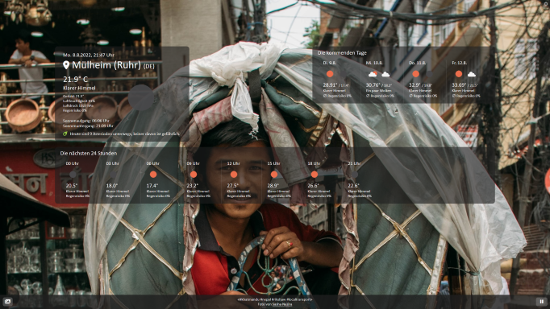

# The Weather / Das Wetter
A simple HTML/JS app forecasting the weather.

It started out as an assignment of an intermediate course in HTML and JavaScript for practicing the fetch API and traversing API responses, and soon became a complete weather app with quite some settings and features.

## Features
- 5-day weather forecast
- Changing image backgrounds from Unsplash, related to the weather conditions, the location, or even both
- Dual-language: English and German
- Meteor warnings (from NASA) (this truely should be part of ANY weather app :-))
- Customizable panel colors
- Location history (including Geo coordinates)
- Background image history (including authors of images)
- Utilizes Local Storage of your browser

The Unsplash background feature can be turned off, then some static images related to the weather conditions are used. The credits for these are shown at the bottom of the screen when displayed.

As the app uses API keys and is a plain Vanilla JS app (does not use Node), there is no way to deploy it for a public online view right now, but I strongly encourage everyone to download the code, get the necessary keys (OpenWeatherMap, Unsplash, and NASA) and run it from local disk - it really is a nice to-have-around.

## Api Keys needed (All free!)
1. [OpenWeatherMap](https://openweathermap.org/api)
2. [Unsplash](https://unsplash.com/documentation)
3. [NASA](https://api.nasa.gov/)

## About the Code
Some short remarks about the code itself:

### Purely Functional Programming Code
No classes, no class-like functions, no encapsulation, no explicit object orientation. As stated above, it started as an assignment about fetch and API responses, so classes were no objective.

### Simple i18n
I created a simple i18n functionality, that is easily extensible to other languages - you would just need to add your language to the translation Map somewhere near the top of the code.

### Globals everywhere
Yes, there are many global variables around - but hey, it works!

### Probably no support for old browsers
I didn't test it, but the code makes heavy use of some features of ECMA Script 2017 like Map or template strings, so probably it won't work on older browsers without some application of babel or the like.

### Funny Responsive Support
I designed the code on a screen with a 2560x1440 resolution, and later added some @media queries so that it would look nice on the smartphone of a friend, but there have been no design considerations in between those two extremes - work them, if you like!